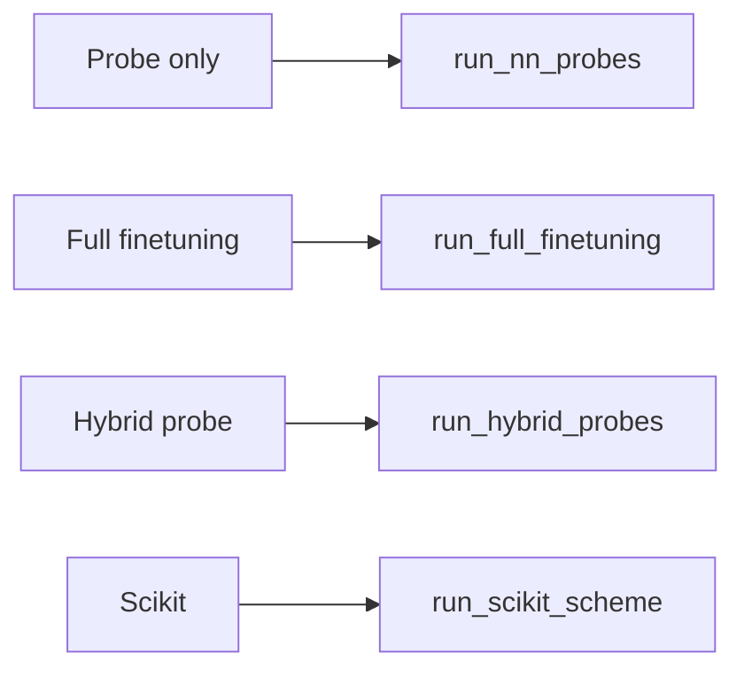

# Probes and Training

This page documents probe types (linear, transformer, lyra), `ProbeArguments` and `get_probe`, `TrainerArguments` and `TrainerMixin`, and the training flows: probe-only (`run_nn_probes`), full finetuning, hybrid, and scikit. It also covers `num_runs` aggregation and model save/export.

---

## Overview

A **probe** is a trainable head on top of (frozen or trainable) base model embeddings. Protify supports three probe types: **linear** (MLP), **transformer**, and **lyra**. Training can be probe-only (default), full base-model finetuning, or hybrid (train probe then finetune base+probe). The scikit path uses precomputed embeddings with sklearn-style models. All probes share a common forward API (embeddings, attention_mask, optional labels) and return loss, logits, and optional hidden_states/attentions.

---

## How it works

1. **ProbeArguments** is built from config; `get_probe(probe_args)` returns the appropriate probe (sequence or token classification).
2. **TrainerMixin** uses `get_probe()`, builds datasets and collators from embeddings (or raw sequences for full/hybrid), and runs the HuggingFace `Trainer` with early stopping and optional multi-run aggregation.
3. **MainProcess** branches: `run_nn_probes()` (default), `run_full_finetuning()`, `run_hybrid_probes()`, or `run_scikit_scheme()` (or W&B hyperopt). Each iterates over models and datasets and calls the appropriate trainer method.



---

## Probe types

| Type | Sequence | Token | Description |
|------|----------|-------|-------------|
| **linear** | Yes | No | MLP on pooled embeddings. Fastest; good baseline. |
| **transformer** | Yes | Yes | Transformer stack + pooler/classifier. Uses [model_components](model_components.md) Transformer. |
| **lyra** | Yes | Yes | S4/Lyra probe; no shared model_components. |

**When to use:** Linear for speed and baselines; transformer for better accuracy when compute allows; lyra for sequence modeling alternatives. Token-wise is for residue-level tasks (e.g. secondary structure).

---

## ProbeArguments

Defined in [get_probe.py](../src/protify/probes/get_probe.py). Key attributes (CLI names in parentheses where different):

| Argument | Type | Default | Description |
|----------|------|---------|-------------|
| `probe_type` | str | linear | linear, transformer, lyra. |
| `tokenwise` | bool | False | Token-wise prediction. |
| `input_size` | int | 960 | Input dimension (set from embedding size). |
| `hidden_size` | int | 8192 | Hidden size for linear probe MLP. |
| `transformer_hidden_size` | int | 512 | Hidden size for transformer. |
| `dropout` | float | 0.2 | Dropout. |
| `num_labels` | int | 2 | Number of classes (set from data). |
| `n_layers` | int | 1 | Number of layers. |
| `task_type` | str | singlelabel | singlelabel, multilabel, regression, etc. |
| `pre_ln` | bool | True | Pre-LayerNorm. |
| `sim_type` | str | dot | dot, cosine, euclidean. |
| `use_bias` | bool | False | Bias in Linear layers. |
| `add_token_ids` | bool | False | Token type embeddings for PPI. |
| `classifier_size` | int | 4096 | Classifier FF dimension. |
| `transformer_dropout` | float | 0.1 | Transformer dropout. |
| `classifier_dropout` | float | 0.2 | Classifier dropout. |
| `head_size` | int | 128 | Attention head dimension; `n_heads = hidden_size // head_size`. |
| `n_heads` | int | None | DEPRECATED (kept for backwards compatibility with old configs/checkpoints). Set `head_size` instead. |
| `rotary` | bool | True | Rotary embeddings. |
| `attention_backend` | str | flex | kernels, flex, sdpa. |
| `output_s_max` | bool | False | Return s_max from attention. |
| `probe_pooling_types` | List[str] | ['mean', 'cls'] | Pooling types (stored as `pooling_types`). |
| `lora` | bool | False | Use LoRA on base model (hybrid/full). |
| `lora_r`, `lora_alpha`, `lora_dropout` | int, float, float | 8, 32.0, 0.01 | LoRA hyperparameters. |

---

## get_probe and rebuild_probe_from_saved_config

- **get_probe(args: ProbeArguments)**
  Returns a probe instance: `LinearProbe`, `TransformerForSequenceClassification`, `TransformerForTokenClassification`, or the Lyra variants. Config is built from `args.__dict__` (with `hidden_size` overridden by `transformer_hidden_size` for transformer).

- **rebuild_probe_from_saved_config(probe_type, tokenwise, probe_config)**
  Rebuilds the same probe classes from a saved config dict (e.g. when loading a packaged model).

---

## TrainerArguments

Defined in [trainers.py](../src/protify/probes/trainers.py).

| Argument | Type | Default | Description |
|----------|------|---------|-------------|
| `model_save_dir` | str | (required) | Output directory for training and HF save. |
| `num_epochs` | int | 200 | Epochs. |
| `probe_batch_size` | int | 64 | Batch size (probe). |
| `base_batch_size` | int | 4 | Batch size (base model). |
| `probe_grad_accum` | int | 1 | Gradient accumulation (probe). |
| `base_grad_accum` | int | 1 | Gradient accumulation (base). |
| `lr` | float | 1e-4 | Learning rate (shared by probe and base phases unless `base_lr` is set). |
| `probe_lr` | Optional[float] | None | Probe-phase learning rate. `None` falls back to `lr`. |
| `base_lr` | Optional[float] | None | Base-model phase learning rate. `None` falls back to `lr`. |
| `lr_scheduler` | str | cosine | Hugging Face `TrainingArguments.lr_scheduler_type`. |
| `optimizer` | str | adamw_torch | Hugging Face `TrainingArguments.optim`. |
| `weight_decay` | float | 0.00 | Weight decay. |
| `task_type` | str | regression | regression or classification. |
| `patience` | int | 3 | Early-stopping patience (probe phase, and base phase unless `base_patience` is set). |
| `base_num_epochs` | Optional[int] | None | Epoch count for the base-model phase of hybrid / full-finetuning training. `None` falls back to `num_epochs`. |
| `base_patience` | Optional[int] | None | Early-stopping patience for the base-model phase. `None` falls back to `patience`. |
| `read_scaler` | int | 100 | For dataset read scaling (e.g. SQL). |
| `save_model` | bool | False | Save/push model (e.g. to Hub). |
| `push_raw_probe` | bool | False | With save_model, push raw probe class to Hub (load with Class.from_pretrained(repo_id)) instead of packaged AutoModel. |
| `seed` | int | 42 | Random seed. |
| `plots_dir` | str | None | Directory for CI plots. |
| `full_finetuning` | bool | False | Full finetuning mode. |
| `hybrid_probe` | bool | False | Hybrid mode. |
| `num_workers` | int | 0 | DataLoader workers. |
| `make_plots` | bool | True | Generate CI plots. |
| `num_runs` | int | 1 | Number of seeds; aggregate mean and std. |
| `parallel_probe_runs` | bool | False | For pooled sequence-level linear probes, train `num_runs` seeded probes in one vectorized pass. |
| `parallel_probe_batch_mode` | str | shared | `shared` reuses each training minibatch across runs; `run_specific` uses deterministic per-run training permutations. |
| `parallel_probe_index_strategy` | str | permutation | For `run_specific`, `permutation` materializes exact per-run shuffled indices; `affine` uses deterministic memory-free bijections. |
| `parallel_probe_max_group_size` | int | None | Optional cap on seeded probes per vectorized bank; larger `num_runs` are chunked into multiple parallel Trainer invocations. |
| `parallel_probe_training_state_budget_gb` | float | None | Optional static trainable-state budget in GiB; derives an automatic parallel-probe group-size cap from parameter, gradient, and AdamW state bytes. |
| `parallel_probe_estimated_peak_budget_gb` | float | None | Optional static peak-memory budget in GiB; derives an automatic group-size cap from trainable state, batch activations, and materialized run-specific index bytes. |
| `parallel_probe_max_grad_norm` | float | 0.0 | Parallel-probe gradient clipping max norm. The default disables global clipping to avoid coupling independent seed banks through one shared gradient norm. |
| `parallel_probe_grad_clip_mode` | str | global | Gradient clipping mode: `none`, `global`, or `per_run`. Use `per_run` with a positive max norm to clip each seed bank independently. |
| `parallel_probe_ensemble_average_mode` | str | logits | How to average seed-bank predictions for reported ensemble metrics: `logits` or `probabilities`. |
| `balanced_regression_metrics` | bool | True | Compute EpHod-style balanced metrics for regression tasks. See [Balanced regression metrics](#balanced-regression-metrics). |
| `balanced_weight_method` | str | bin_inv | One of `none`, `bin_inv`, `bin_inv_sqrt`, `LDS_inv`, `LDS_inv_sqrt`, `LDS_extreme`. |
| `balanced_bin_borders` | List[float] | None | Explicit bin borders for digitization (e.g. `[5, 9]` for pH). None uses 1/3 and 2/3 quantiles of training labels. |
| `balanced_n_resamples` | int | 100 | Number of weight-draws for resampled Pearson/Spearman. |
| `balanced_lds_bins`, `balanced_lds_ks`, `balanced_lds_sigma` | int, int, float | 100, 5, 2.0 | LDS kernel hyperparameters (only used for `LDS_*` methods). |

Calling `trainer_args(probe=True)` or `trainer_args(probe=False)` returns HuggingFace `TrainingArguments` with the appropriate batch size and grad accumulation.

---

## Training flows

- **run_nn_probes():** For each (model, dataset), load embeddings from disk (or use in-memory dict), build probe with `get_probe(probe_args)`, run `trainer_probe()`. Single run or `num_runs` with aggregation (mean and std, best run by test loss).
- **run_full_finetuning():** Uses raw sequences; builds base model for training (no probe head for sequence-level; base outputs go to loss). Same single/multi-run pattern via `trainer_base_model()`.
- **run_hybrid_probes():** For each run: (1) train probe only (`trainer_probe`, skip_plot=True), (2) wrap base + trained probe in `HybridProbe`, (3) run `trainer_base_model(hybrid_model, ...)`. Aggregates metrics; optionally plots best run.
- **run_scikit_scheme():** Uses `prepare_scikit_dataset` and sklearn/lazy-predict; no probe training.

---

## num_runs aggregation

When `num_runs > 1`, the trainer runs training `num_runs` times with different seeds, collects metrics (e.g. test loss, spearman), and computes mean and std. The best run (by test loss or selected metric) is used for optional CI plots and reporting. Metrics logged include `*_mean` and `*_std` variants.

Set `parallel_probe_runs=True` (CLI: `--parallel_probe_runs`) to use the vectorized path for pooled, sequence-level linear probes. This builds `ParallelLinearProbe` banks with an explicit run dimension over independently initialized parameters, uses batched matrix multiplication across runs, shares each minibatch across runs by default, sums per-run losses during training to preserve each run's gradient scale, averages per-run loss for evaluation/early stopping, aggregates metrics across all seeds, and exports the best run back to a normal `LinearProbe`. Matrix/tokenwise probes, transformer probes, Lyra probes, and full fine-tuning continue to use the sequential path.

During HuggingFace validation evaluation, the parallel path also emits per-run metric keys such as `eval_run_0_loss`, `eval_run_0_accuracy`, and `eval_run_1_loss` through `compute_metrics`. Early stopping and checkpoint selection still use the aggregate bank-level `eval_loss`, so these per-run keys are observability and parity checks rather than independent checkpoint selectors. The explicit post-training valid/test prediction pass computes `parallel_probe_valid_run_metrics` and `parallel_probe_test_run_metrics` itself and disables redundant HuggingFace `compute_metrics` during `predict`.

The planning layer in [parallel_probe_plan.py](../src/protify/probes/parallel_probe_plan.py) represents each candidate run as a `ParallelProbeRunSpec` and groups only runs with matching model, dataset, embedding cache, trainer settings, batch mode, and linear probe architecture. `ParallelProbeExecutionPlan` summarizes a larger model universe / dataset universe / probe universe sweep, including vectorized groups, sequential fallbacks, trainer invocation reduction, and a largest-parallel-first execution order. `estimate_parallel_probe_plan()` adds static trainable-state estimates: linear-probe parameter bytes, gradient bytes, and AdamW moment bytes for each vectorized bank. When a caller provides planned batch and dataset sizes, it also estimates per-batch activation/logit bytes and materialized run-specific permutation-index bytes. The Trainer executes the compatible seed groups for one model/dataset pair; `parallel_probe_max_group_size` can split a large seed set into multiple vectorized banks so workstation runs can sweep the utilization and memory tradeoff without returning to fully sequential training. `parallel_probe_training_state_budget_gb` derives this group-size cap automatically from trainable state only; `parallel_probe_estimated_peak_budget_gb` includes trainable state, batch activations, and materialized run-specific index bytes. If multiple caps are set, the smallest cap is used.

Use `parallel_probe_batch_mode='shared'` for the highest reuse: every run sees the same minibatch order while keeping independent weights and losses. Use `parallel_probe_batch_mode='run_specific'` to wrap the training dataset with [ParallelRunDataset](../src/protify/probes/parallel_probe_batches.py), which feeds run-specific pooled batches shaped `[batch, runs, dim]` with labels shaped `[batch, runs]` or `[batch, runs, labels]`. Validation and test batches remain shared across runs so per-run metrics compare on the same examples. The `run_specific` mode is limited to pooled non-PPI embedding datasets. Its default `parallel_probe_index_strategy='permutation'` materializes exact per-run shuffled indices as compact tensors; `parallel_probe_index_strategy='affine'` uses deterministic memory-free bijections for very large corpora where storing one permutation per run would be too expensive. When the base dataset exposes in-memory pooled embeddings or a two-tensor `TensorDataset`, `ParallelRunDataset` builds a tensor cache and uses vectorized `index_select` instead of calling the base dataset once per seed per sample. This is the recommended path for pre-embedded probe sweeps.

Per-run metric and loss reporting uses the same label-shape rules as `ParallelLinearProbe.forward`, so `[batch, runs]` scalar labels and explicit `[batch, runs, labels]` labels are sliced by run before metric computation.

Parallel probe test metrics include execution metadata: `parallel_probe_batch_mode`, `parallel_probe_index_strategy`, `parallel_probe_ensemble_average_mode`, `parallel_probe_max_group_size`, `parallel_probe_training_state_budget_gb`, `parallel_probe_estimated_peak_budget_gb`, `parallel_probe_max_grad_norm`, `parallel_probe_grad_clip_mode`, `parallel_probe_effective_max_group_size`, `parallel_probe_explicit_max_group_size`, `parallel_probe_training_state_budget_group_size`, `parallel_probe_estimated_peak_budget_group_size`, `parallel_probe_group_size_candidates`, `parallel_probe_peak_budget_includes_index`, `parallel_probe_group_sizes`, `parallel_probe_group_run_seeds`, `parallel_probe_group_runtime_records`, `parallel_probe_index_memory_bytes`, `parallel_probe_index_memory_total_bytes`, `parallel_probe_estimated_training_state_bytes`, `parallel_probe_estimated_batch_activation_bytes`, `parallel_probe_estimated_run_specific_index_bytes`, `parallel_probe_estimated_peak_group_bytes`, `parallel_probe_estimated_forward_flops_per_batch`, `parallel_probe_estimated_peak_group_forward_flops_per_batch`, `parallel_probe_estimated_training_flops_per_batch`, `parallel_probe_estimated_peak_group_training_flops_per_batch`, `parallel_probe_total_runs`, `parallel_probe_trainer_invocations`, `parallel_probe_invocation_reduction`, and `parallel_probe_compression_ratio`. They also include per-seed and best-run metadata: `parallel_probe_run_seeds`, `parallel_probe_run_records`, `parallel_probe_valid_run_metrics`, `parallel_probe_test_run_metrics`, `parallel_probe_best_selection_metric`, `parallel_probe_best_run_index`, `parallel_probe_best_run_id`, `parallel_probe_best_seed`, and `parallel_probe_best_test_loss`. Each `parallel_probe_run_records` item ties a seed to its run id, vectorized group, local bank index, validation loss, and test loss so workstation comparisons can be checked seed-by-seed. Each `parallel_probe_group_runtime_records` item ties a vectorized group to its runtime, seconds per seed, run seeds, output directory, index-memory bytes, estimated peak bytes, and estimated training FLOPs per batch. The full per-run metric lists are kept for parity checks against sequential runs.

The parallel path also reports ensemble metrics computed from the full trained seed bank, including `parallel_probe_ensemble_eval_*` in validation metrics and `parallel_probe_ensemble_test_*` in test metrics. The sequential multi-seed probe path reports `sequential_probe_ensemble_test_*` from the same style of prediction averaging, so validation can compare sequential and parallel seed ensembles directly. `parallel_probe_ensemble_average_mode='logits'` averages raw run outputs before metrics; `parallel_probe_ensemble_average_mode='probabilities'` averages softmax/sigmoid probabilities for classification-style tasks, then converts those averaged probabilities back to metric-compatible scores. This lets workstation runs compare best-run, per-run mean/std, and seed-ensemble behavior from the same vectorized pass.

The parallel path uses `parallel_probe_grad_clip_mode` to decide how to apply `parallel_probe_max_grad_norm`. With `global`, a positive norm is passed to HuggingFace Trainer and clips the whole vectorized bank with one shared norm. With `per_run`, HuggingFace global clipping is disabled and a callback clips each seed's parameter slices independently before the optimizer step, which better matches sequential seed semantics. With `none`, clipping is disabled even if a positive norm is set. The default max norm is `0.0`, so clipping is off unless explicitly enabled.

With `save_model=True`, the parallel path saves the exported best `LinearProbe` selected by test loss. It does not save the full `ParallelLinearProbe` parameter bank or one Hub repo per seed.

For in-process inference on the full trained bank, `ParallelLinearProbe.to_ensemble(run_indices=None, average_mode='logits')` returns a wrapper that averages selected seed outputs. `average_mode='probabilities'` averages softmax or sigmoid probabilities for classification-style tasks. The packaged save path still exports the selected best `LinearProbe`, not the ensemble bank.

When `parallel_probe_max_group_size` or a budget cap splits seeds into multiple vectorized groups, each group uses its own `parallel_group_N` Trainer output directory to avoid checkpoint collisions between banks.

Synthetic benchmark:

```bash
python -m scripts.benchmark_parallel_probes --plan_only --num_runs 8 --num_samples 8192 --input_size 320 --hidden_size 256 --batch_size 256
python -m scripts.benchmark_parallel_probes --num_runs 8 --num_samples 8192 --input_size 320 --hidden_size 256 --batch_size 256 --epochs 3 --device cuda --data_on_device
```

The `--plan_only` form emits the synthetic plan and static estimates without resolving a device, allocating synthetic tensors, or training. The benchmark's `--num_labels` flag is only for synthetic random-label generation. Normal `python -m main` runs infer `num_labels` from the dataset and do not accept `--num_labels`.

Batch-mode comparisons:

```bash
python -m scripts.benchmark_parallel_probes --num_runs 8 --parallel_batch_mode shared --device cuda --data_on_device
python -m scripts.benchmark_parallel_probes --num_runs 8 --parallel_batch_mode run_specific --parallel_index_strategy permutation --device cuda --data_on_device
python -m scripts.benchmark_parallel_probes --num_runs 8 --parallel_batch_mode run_specific --parallel_index_strategy affine --device cuda --data_on_device
python -m scripts.benchmark_parallel_probes --num_runs 32 --parallel_max_group_size 8 --device cuda --data_on_device
```

The benchmark JSON includes the planner summary plus `total_parameter_count`, `total_training_state_bytes`, `peak_group_training_state_bytes`, `total_batch_activation_bytes`, `peak_group_batch_activation_bytes`, `total_run_specific_index_bytes`, `peak_group_estimated_peak_bytes`, `total_forward_flops_per_batch`, `peak_group_forward_flops_per_batch`, `total_training_flops_per_batch`, `peak_group_training_flops_per_batch`, and `unknown_estimate_group_count`. These are static estimates for the vectorized probe banks, not measured GPU memory or measured throughput. Both `--plan_only` and measured benchmark output include a `comparison` block with speedup formulas, runtime metric keys, and hardware metric keys to collect on workstation runs.

No-training universe preflight:

```bash
python -m scripts.plan_parallel_probes --model_names ESM2-35 ESM2-8 --data_names EC DeepLoc-2 --input_size 320 --num_runs 16 --parallel_max_group_size 8 --probe_batch_size 256 --train_dataset_size 100000
```

Probe-configuration sweep preflight:

```bash
python -m scripts.plan_parallel_probes --model_names ESM2-35 --data_names EC --input_size 320 --num_runs 8 --probe_hidden_sizes 512 1024 2048 --probe_dropouts 0.0 0.2 --probe_n_layers 0 1 --parallel_max_group_size 4 --estimated_peak_budget_gb 20
```

Co-scheduling wave preflight:

```bash
python -m scripts.plan_parallel_probes --model_names ESM2-35 ESM2-8 --data_names EC DeepLoc-2 --input_size 320 --num_runs 16 --parallel_max_group_size 8 --probe_batch_size 256 --train_dataset_size 100000 --wave_max_groups 4 --wave_memory_budget_gb 60 --wave_target_training_flops_per_batch 1000000000000
```

This command does not import datasets, load models, compute embeddings, or start Trainer. It builds the same `ParallelProbeRunSpec` universe the execution path uses, groups compatible model/dataset/probe/seed runs, and emits JSON with Trainer invocation reduction plus static parameter, gradient, optimizer-state, batch-activation, matmul FLOP, and optional permutation-index estimates. Use it to decide candidate `parallel_probe_max_group_size` values before launching real workstation runs. Different probe shapes are kept in separate groups; seeds within each compatible model/dataset/probe group can still be vectorized. Each `groups` entry includes model, dataset, embedding, trainer, and probe-shape identity fields. The planner accepts its own `--num_labels` estimate because it does not load data; generated `python -m main` commands omit `--num_labels` because real Protify training detects label count from the dataset. The `embedding_prerequisites` block describes the embedding cache jobs required before probe training. It emits one `_PROTIFY_EMBED_PHASE=1 python -m main ... --save_embeddings` command per model/dataset pair, records how many downstream seed/probe runs reuse that cache, and intentionally keeps embedding co-scheduling separate from probe waves because PLM sizes, sequence lengths, and cache writes can dominate resource use. Shape those static commands with `--embedding_save_dir`, `--embedding_batch_size`, `--embedding_num_workers`, `--embedding_pooling_types`, `--embedding_hidden_state_index`, `--embed_dtype`, `--sql`, and `--download_embeddings`. The `launch_manifest` block turns probe groups into accepted `python -m main` command arrays for sequential baselines and supported parallel groups, plus `python -m scripts.monitor_parallel_probe_hardware` wrappers with deterministic telemetry output paths. It also maps `execution_waves` back to command ids. These are templates, not an auto-executor, and they assume the target workstation has the intended datasets, cached embeddings, and normal Protify runtime configuration. Customize telemetry templates with `--telemetry_dir`, `--monitor_interval_seconds`, and `--monitor_gpu_index`. Use `--parallel_max_grad_norm` and `--parallel_grad_clip_mode per_run` when templating sequential-parity runs that should clip each seed bank independently. With `--training_state_budget_gb`, the report adds `probe_config_recommendations` with each probe shape plus a conservative seed group-size recommendation based on parameter, gradient, and AdamW state bytes. With `--estimated_peak_budget_gb`, the recommendation also accounts for batch activations and permutation-index bytes. Budget-derived caps are applied per compatible model/dataset/probe bucket, each planned group reports `applied_group_size_cap`, and the top-level report includes `effective_group_size_caps` so mixed probe universes can use different group sizes. The `execution_waves` block packs planned Trainer invocations into static co-scheduling waves. By default `--wave_max_groups 1` matches current one-group-at-a-time execution. Increase `--wave_max_groups` and set `--wave_memory_budget_gb` to model concurrent launches that should fit in device memory; set `--wave_target_training_flops_per_batch` to flag waves that may still be too small to keep a high-end GPU busy. Add `--gpu_peak_tflops` and `--gpu_memory_bandwidth_gbps` to emit a `hardware_roofline` block with per-wave compute lower bounds, resident-byte bandwidth lower bounds, roofline bottleneck labels, total lower-bound seconds per batch, and the same roofline fields on recommendation candidates. These are planning lower bounds from static estimates, not measured utilization. Use `--gpu_indices` to attach per-group `CUDA_VISIBLE_DEVICES` metadata to the launch manifest. In the default `--gpu_assignment_mode packed`, every group in a wave is placed on the same GPU so concurrent light probes can deliberately share one high-end device; `round_robin` instead spreads groups within each wave. Each wave reports `gpu_assignments` with command ids, group indices, total runs, summed estimated peak bytes, max single-group bytes, memory-budget fit, and training FLOPs per batch for each assigned GPU. The launch manifest also summarizes total per-GPU assignment count, over-budget assignment count, over-budget wave count, and peak assigned-GPU estimated bytes. Monitor commands automatically sample the assigned physical GPU unless `--monitor_gpu_index` is set. The `execution_recommendation` block ranks budget-aware group-size candidates and selects a concrete `parallel_probe_max_group_size`, parallel CLI snippet, and launch-manifest runner args. Runner arg templates include `--output_path` under `--telemetry_dir` so dry-run and execution reports are saved next to telemetry summaries. For co-scheduled plans, use `manifest_runner_sequential_execute_args` for baseline timing and `manifest_runner_parallel_execute_args` for the concurrent parallel launch; `manifest_runner_execute_args` remains a conservative sequential-wave all-variant command. It respects an explicit `--parallel_max_group_size` as a hard cap, but still lets the broader sweep show larger what-if rows. The `validation_readiness` block summarizes whether the static plan is `ready`, `ready_with_cautions`, `needs_adjustment`, or `not_ready`, and lists warnings such as `no_vectorized_groups`, `eligible_singleton_groups_present`, `low_invocation_compression`, `waves_over_memory_budget`, or `waves_under_target_training_flops`. The `validation_comparison` block gives sequential and parallel CLI arg snippets, ready-to-fill `compare_conservative_args` and `compare_coscheduled_args`, the trainer-invocation speedup ceiling, explicit wall-clock/per-run speedup formulas, hardware metric keys to collect, runtime metric keys to compare, and a no-training `parallel_probe_max_group_size` sweep. The compare templates include launch manifest, runner-report, telemetry, manifest coverage, probe-config coverage, successful-runner-report gates, and `--output_path` values for durable comparison JSON. When budget caps are present, sweep rows are budget-aware and include `max_effective_group_size` plus `budget_constrained`. Set `--probe_batch_size` to the intended probe batch size and `--train_dataset_size` to the training split size if you want peak-byte, FLOP-per-batch, and run-specific permutation-index estimates. `--training_flop_multiplier` defaults to `3` for a rough forward/backward/update estimate. `--parallel_index_strategy affine` reports zero index bytes because it uses deterministic bijections instead of materialized permutations.

After saving a preflight JSON report, use `python -m scripts.run_parallel_probe_launch_manifest --manifest_path preflight.json` to dry-run the planned parallel commands by execution wave. The runner defaults to `--phase probes`; use `--phase embeddings` to dry-run or execute the `_PROTIFY_EMBED_PHASE=1` cache-prerequisite commands, or `--phase all` to place the embedding prerequisite wave before probe waves in one runner report. Add `--variant sequential`, `--variant both`, `--use_monitor`, `--wave_ids`, or `--command_ids` to inspect the exact subset you intend to run. Add `--output_path runner-report.json` to save the dry-run or execution report for later comparison notes. Add `--skip_completed` to omit commands whose monitor summary JSON already exists, which makes interrupted workstation sweeps easier to resume without re-running completed variants. The runner is dry-run by default and only invokes commands when `--execute` is explicitly provided. It refuses to execute selected waves that exceed the preflight GPU memory budget unless `--allow_over_budget` is explicitly passed. Execution defaults to one command after another; add `--wave_execution_mode concurrent` on the workstation to launch all parallel commands within a planned wave together, then move to the next wave after they finish. Concurrent launch with `--variant sequential` or `--variant both` is blocked by default because it can contaminate baseline timing; use `--allow_baseline_concurrency` only for deliberate throughput tests rather than validation runs.

Recommended workstation validation:

- Start with the synthetic benchmark above on CPU, then on the target GPU with `--data_on_device` to isolate probe math from input transfer.
- Sweep `--num_runs 2 4 8 16 32`, keeping `num_samples`, `input_size`, `hidden_size`, `batch_size`, and `epochs` fixed.
- For large `num_runs`, sweep `--parallel_probe_max_group_size 4 8 16 32` or set `--parallel_probe_estimated_peak_budget_gb` to derive a static group-size cap before tuning manually.
- Use `execution_waves` from the no-training preflight to choose candidate concurrent launch waves across model/dataset/probe groups once single-bank utilization is known.
- Record sequential seconds, parallel seconds, speedup, peak memory, GPU utilization, SM occupancy, memory bandwidth, and CPU utilization.
- Repeat with real cached embeddings through the CLI by comparing `--num_runs N` versus `--num_runs N --parallel_probe_runs` on the same model, dataset, split, and probe settings.
- Compare `parallel_probe_run_records`, `parallel_probe_valid_run_metrics`, and `parallel_probe_test_run_metrics` against the sequential per-run logs before interpreting speedups.
- Compare `--parallel_probe_batch_mode shared` against `--parallel_probe_batch_mode run_specific --parallel_probe_index_strategy permutation`, and use `--parallel_probe_index_strategy affine` for very large corpora when permutation-index memory becomes visible.
- Treat shared minibatch order as an explicit throughput mode: it maximizes shared I/O and arithmetic intensity, but it is not semantically identical to the sequential path where each seed can get an independent shuffle.
- Use `run_specific` mode with `permutation` for the closest sequential comparison when validating speed and metrics.
- Validate downstream metrics are statistically comparable across seeds before making a new workload default to parallel mode.

Validated workstation evidence on a GH200 class machine:

- Focused parallel-probe test suite: `180 passed`.
- Real ESM2-8 / DeepLoc-2 8-seed comparison, run-specific permutation mode: sequential probe training `13.81s`, parallel probe training `6.6212s`, speedup `2.0857x`.
- Strict comparison report status: pass with metric failures `0`, ensemble metric failures `0`, and complete sequential plus parallel telemetry coverage.
- Synthetic small-probe CUDA benchmark with 64 seeds: sequential `41.66s`, parallel `16.24s`, speedup `2.57x`.

To collect GPU telemetry during future workstation runs, wrap either a sequential or parallel command with the hardware monitor:

```bash
python -m scripts.monitor_parallel_probe_hardware --output_jsonl telemetry/parallel.jsonl --summary_json telemetry/parallel.summary.json --gpu_index 0 --interval_seconds 1 --command -- python -m main --model_names ESM2-35 --data_names EC --num_runs 8 --parallel_probe_runs
```

The monitor samples `nvidia-smi` into JSONL and writes a summary with mean/max GPU utilization, memory utilization, memory used, power draw, SM clock, and sampled duration. Use `--dry_run` to inspect the wrapper command without launching it, or `--summarize_jsonl telemetry/parallel.jsonl` to recompute a summary from an existing telemetry file.

After collecting sequential and parallel Protify result TSVs, use the no-training comparison helper to compute wall-clock speedups and metric parity:

```bash
python -m scripts.compare_parallel_probe_runs --sequential_results results/sequential.tsv --parallel_results results/parallel.tsv --metric_abs_tolerance 0.01
```

The comparison helper also accepts JSON records. It infers `num_runs` from `parallel_probe_total_runs`, `parallel_probe_run_records`, or explicit `num_runs`; treats sequential `training_time_seconds_mean` as per-run time; compares parallel `training_time_seconds` and `parallel_probe_seconds_per_run`; and reports matched/missing dataset-model pairs plus per-metric absolute and relative differences. Add `--output_path compare.report.json` to persist the JSON report. When parallel results include `parallel_probe_group_runtime_records`, each pair report adds `parallel_group_runtime` with group counts, total group runtime, max seconds per run, and the slowest vectorized or singleton group. The top-level `summary.parallel_group_runtime` aggregates those diagnostics across all matched pairs, including total vectorized groups, total singleton groups, aggregate group runtime, and the slowest group in the sweep. When both result files include seed-ensemble metrics, it adds a separate `ensemble_metric_comparisons` block that pairs `sequential_probe_ensemble_test_*` against `parallel_probe_ensemble_test_*`. The report includes `summary.validation_verdict`, a machine-readable gate over result-pair coverage, metric parity, wall-clock speedup, optional ensemble parity, optional manifest result coverage, optional exact probe-config result coverage, optional manifest speedup efficiency, optional runner-report health, and optional telemetry thresholds. Tune it with `--min_wall_clock_speedup`, `--min_per_run_speedup`, `--min_manifest_speedup_efficiency`, `--max_failing_metric_count`, `--require_manifest_result_coverage`, `--require_manifest_probe_result_coverage`, `--require_ensemble_metrics`, `--require_complete_telemetry`, `--require_successful_runner_reports`, `--min_parallel_gpu_utilization_percent`, and `--min_gpu_utilization_gain_percent`. Pass `--launch_manifest preflight.json` to report planned model/dataset result coverage and compare observed wall-clock speedup against the preflight `trainer_invocation_speedup_ceiling`; the reported `manifest_speedup_efficiency` is their ratio. Add `--require_manifest_result_coverage` when the result files should include every model/dataset pair in the preflight, including pairs that would otherwise be invisible because they are absent from both sequential and parallel outputs. For probe-shape sweeps, standard Protify result TSV cells now include `probe_type`, `hidden_size`, `dropout`, `n_layers`, `task_type`, and `num_labels`; JSON result records can include the same fields. Add `--require_manifest_probe_result_coverage` to require exact coverage of every planned probe configuration. Pass saved runner reports with `--runner_reports telemetry/manifest_runner_execute.report.json`; add `--require_successful_runner_reports` to require at least one saved execution report with no over-budget block, unknown selected command ids, missing wave command ids, nonzero command returns, runner failures, or missing executed command results. When a launch manifest is also supplied, runner-report validation checks exact `(command_id, variant)` coverage against every planned sequential and parallel probe command, so a clean but partial launch cannot silently pass. Embedding-prerequisite commands from `--phase embeddings` or `--phase all` runner reports are included in runner summaries but ignored for probe manifest coverage. Executed commands and resume skips with `skip_reason='completed_summary_exists'` count as covered; empty-command skips do not. If monitor summary JSON files were produced through the launch manifest, also pass `--sequential_telemetry_summaries telemetry/*_sequential.summary.json --parallel_telemetry_summaries telemetry/*_parallel.summary.json` to aggregate utilization summaries by dataset/model and compare GPU utilization, memory, power, clocks, and telemetry duration alongside metric parity. The report also includes `telemetry_coverage` so missing, unexpected, or duplicate summary files are visible before interpreting utilization.

---

## Balanced regression metrics

For regression tasks, Protify reports a second set of metrics designed to handle skewed label distributions, ported from EpHod (Gado et al., *Nature Machine Intelligence* 2025; [github.com/jafetgado/EpHod](https://github.com/jafetgado/EpHod)). The motivation: when ~75% of labels cluster in a narrow region (e.g. pH 6-8), standard RMSE, R^2, Pearson, and Spearman are dominated by the mode and understate error on rare extremes.

Sample weights are derived from the **training** labels once at dataset-load time and reused for valid and test scoring. Implementation in [src/protify/metrics_balanced.py](../src/protify/metrics_balanced.py).

### Weighting schemes

| Method | Description |
|--------|-------------|
| `none` | Uniform weights (mean 1). |
| `bin_inv` | Digitize labels with `bin_borders`; weight = 1 / bin_count. **EpHod default.** |
| `bin_inv_sqrt` | `sqrt(bin_inv)` (milder upweighting). |
| `LDS_inv` | Label Distribution Smoothing (Yang et al. 2021): Gaussian-smoothed histogram over 100 bins; weight = 1 / smoothed density. |
| `LDS_inv_sqrt` | `sqrt(LDS_inv)`. |
| `LDS_extreme` | `LDS_inv` with rare values (`y <= borders[0]` or `y >= borders[-1]`) doubled. |

All schemes are normalized to mean 1.

### Reported metrics (`balanced_` prefix)

- `balanced_weighted_rmse`, `balanced_weighted_r_squared`
- `balanced_weighted_pearson_rho`, `balanced_weighted_spearman_rho` (mean over `n_resamples` weight-balanced bootstrap draws)
- `balanced_weighted_pearson_rho_std`, `balanced_weighted_spearman_rho_std`
- `balanced_binned_mcc` (multi-class MCC on digitized labels)
- `balanced_binned_f1_per_bin`, `balanced_binned_f1_mean` (one-vs-rest F1)
- `balanced_binned_roc_auc_per_bin`, `balanced_binned_roc_auc_mean` (one-vs-rest ROC-AUC)
- `balanced_bin_borders`, `balanced_n_bins`, `balanced_n_resamples` (echoed for transparency)

### Example: pH regression with explicit borders

```bash
py -m main --model_names ESM2-8 --data_names EpHod \
    --balanced_weight_method bin_inv \
    --balanced_bin_borders 5 9
```

### Example: auto bin borders (tertiles)

Omit `--balanced_bin_borders` to use `[quantile(y_train, 1/3), quantile(y_train, 2/3)]`:

```bash
py -m main --model_names ESM2-8 --data_names MyRegressionDataset \
    --balanced_weight_method bin_inv_sqrt
```

### Disable

```bash
py -m main --model_names ESM2-8 --data_names MyRegressionDataset \
    --no_balanced_regression_metrics
```

---

## save_model and export

When `save_model` is True, after training the code can export to the HuggingFace Hub in two ways:

- **Default (packaged):** Export a packaged model (backbone + probe) via `export_packaged_model_to_hub(...)`. The repo is loadable with `AutoModel.from_pretrained(repo_id)`. If packaged export is not supported or fails, it falls back to pushing the full model (hybrid or probe) and a README.
- **Raw probe (`--push_raw_probe`):** Skip packaged export and push only the raw probe class plus a README. Load with the probe class directly. For hybrid runs, only the probe submodule is pushed, not the full hybrid.

For `parallel_probe_runs=True`, the save/export target is the selected best run converted back to a normal `LinearProbe`.

Production export uses the same probe rebuild API so that the packaged artifact can be loaded elsewhere.

---

## Examples

### Linear probe (default)

```bash
py -m src.protify.main --model_names ESM2-8 --data_names DeepLoc-2 --probe_type linear
```

### Transformer probe with more layers

```bash
py -m src.protify.main --model_names ESM2-35 --data_names DeepLoc-2 --probe_type transformer --n_layers 2 --transformer_hidden_size 256
```

### Multiple runs with aggregation

```bash
py -m src.protify.main --model_names ESM2-8 --data_names DeepLoc-2 --num_runs 3
```

### Full finetuning

```bash
py -m src.protify.main --model_names ESM2-8 --data_names DeepLoc-2 --full_finetuning --num_epochs 10
```

### Hybrid probe

```bash
py -m src.protify.main --model_names ESM2-8 --data_names DeepLoc-2 --hybrid_probe
```

The hybrid flow runs in two phases with the same `--num_epochs`, `--patience`, and `--lr` by default: first a probe-only phase on frozen PLM embeddings, then a joint phase that unfreezes the base model (optionally LoRA-wrapped via `--lora`). Use `--probe_lr`, `--base_num_epochs`, `--base_patience`, and `--base_lr` to decouple the phases - for example, training the probe for many epochs and then doing a short LoRA pass at a higher LR:

```bash
py -m src.protify.main \
    --model_names DPLM2-3B --data_names optimal-ph \
    --matrix_embed --sql --probe_type transformer \
    --hybrid_probe --lora \
    --num_epochs 15 --patience 3 --probe_lr 2e-5 \
    --base_num_epochs 1 --base_patience 1 --base_lr 2e-4
```

When phase-specific flags are omitted, both phases fall back to `--lr`, `--num_epochs`, and `--patience`, preserving the original single-setting behavior.

### Scikit path

```bash
py -m src.protify.main --model_names ESM2-8 --data_names DeepLoc-2 --use_scikit
```

---

## See also

- [Configuration](cli_and_config.md) for probe and trainer CLI flags
- [Model components](model_components.md) for attention and transformer used by probes
- [Models and embeddings](models_and_embeddings.md) for how embeddings are produced
- [Data](data.md) for dataset building
- [Hyperparameter optimization](hyperparameter_optimization.md) for W&B sweep
